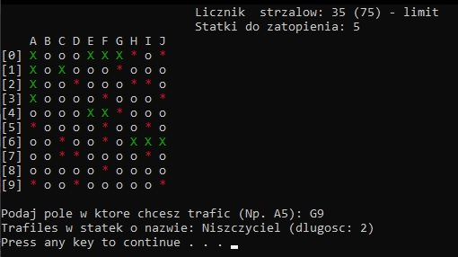
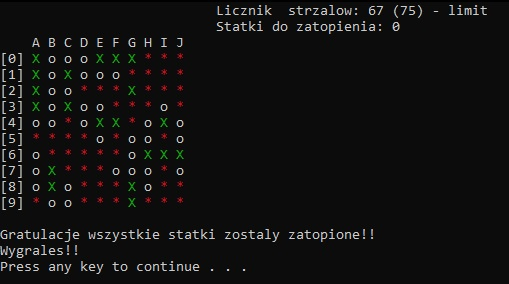

  <h1 >Statki-Battleships</h1>
  
Konsolowa gra w c++

  <table>
        <tr>
            <td>
                 
            </td>
            <td>
                 
            </td>
        </tr>
  </table>
  
Zasady

  
Twoim zadaniem jest zatopienie wszystkich 10 statkow przeciwnika.

  (1 statek 4-kratkowy, 2 statki 3-kratkowe, 3 statki 2-kratkowe, 4 statki 1-kratkowe)
  
1) Wpisuj koordynaty np. B5, C9

  
2) Ilosc strzalow jest ograniczona

  
3) Wygrywasz jesli zatopisz wszystkie statki i nie zabraknie ci strzalow

  
4) Milej gry!

<h1></h1>
